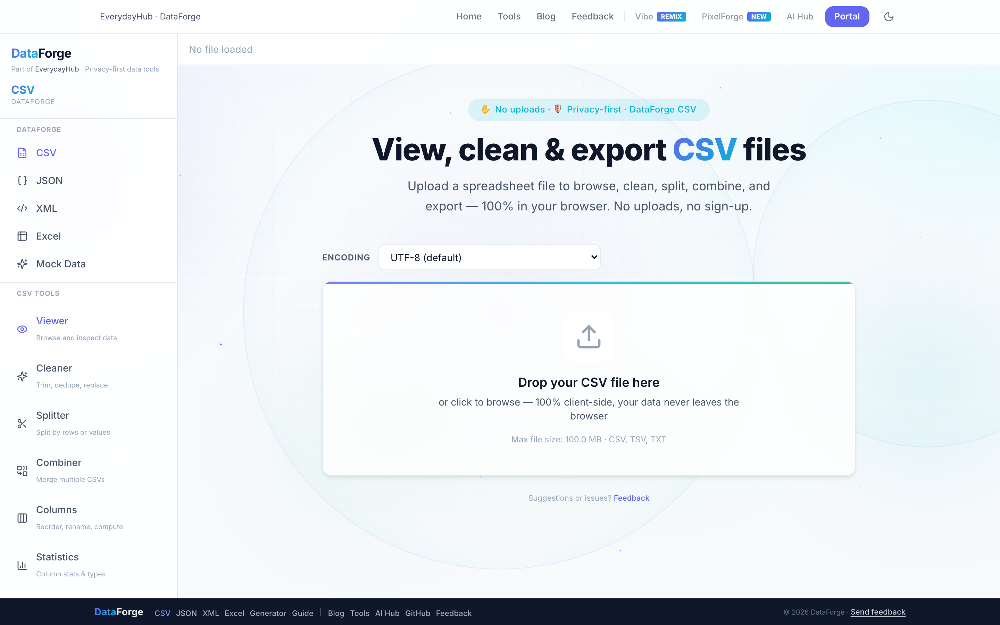
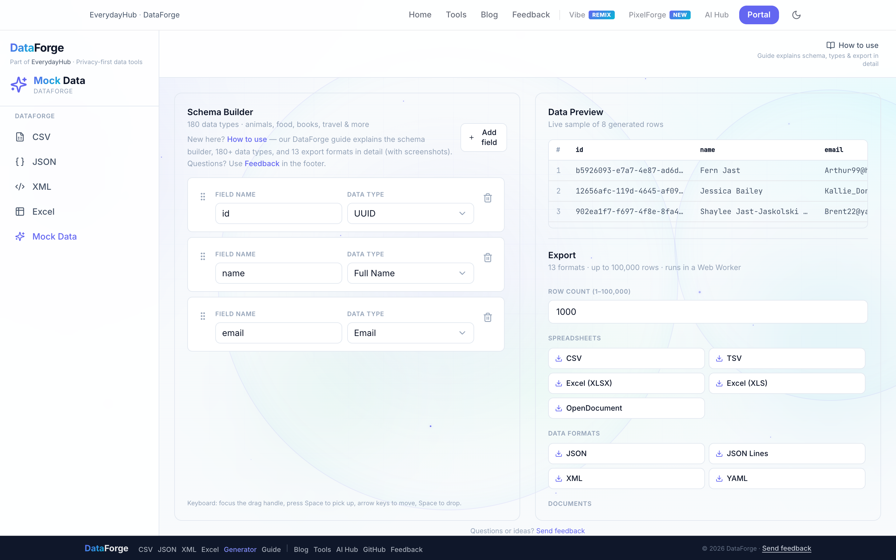
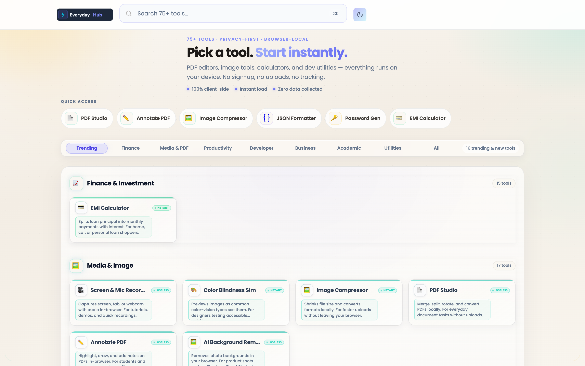
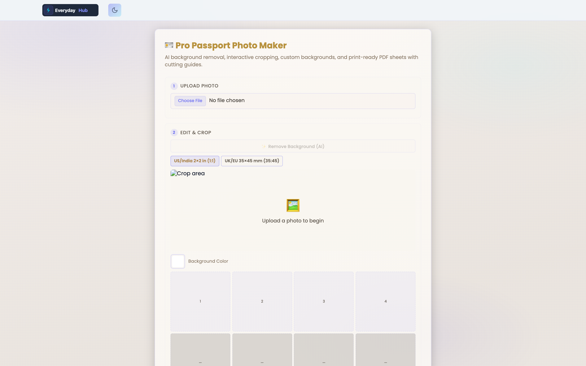
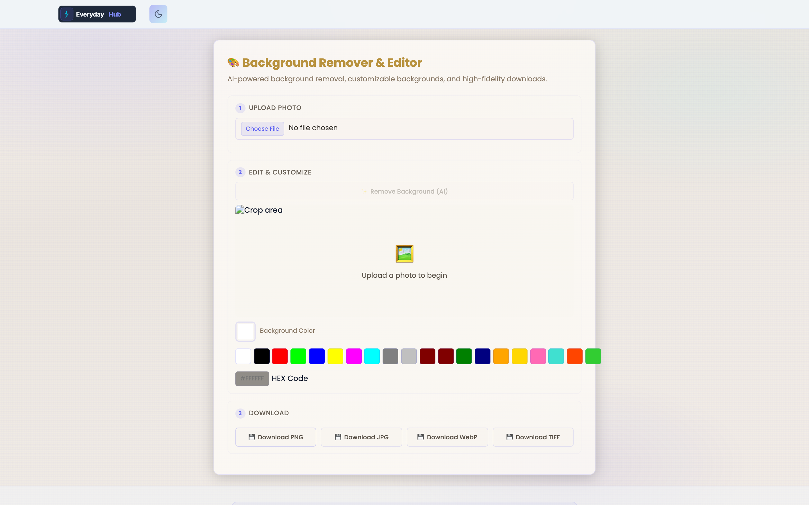
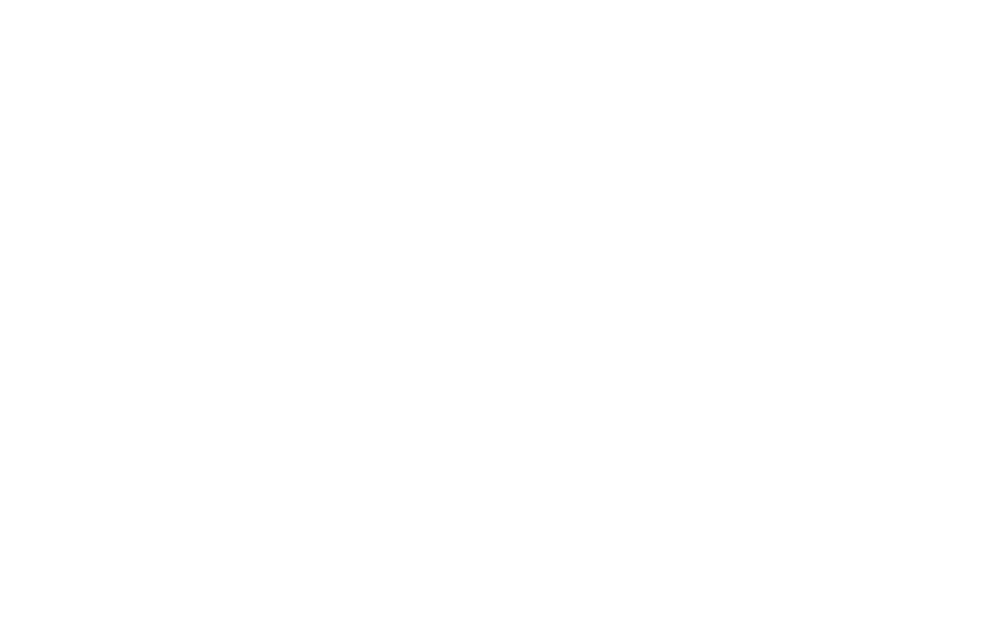
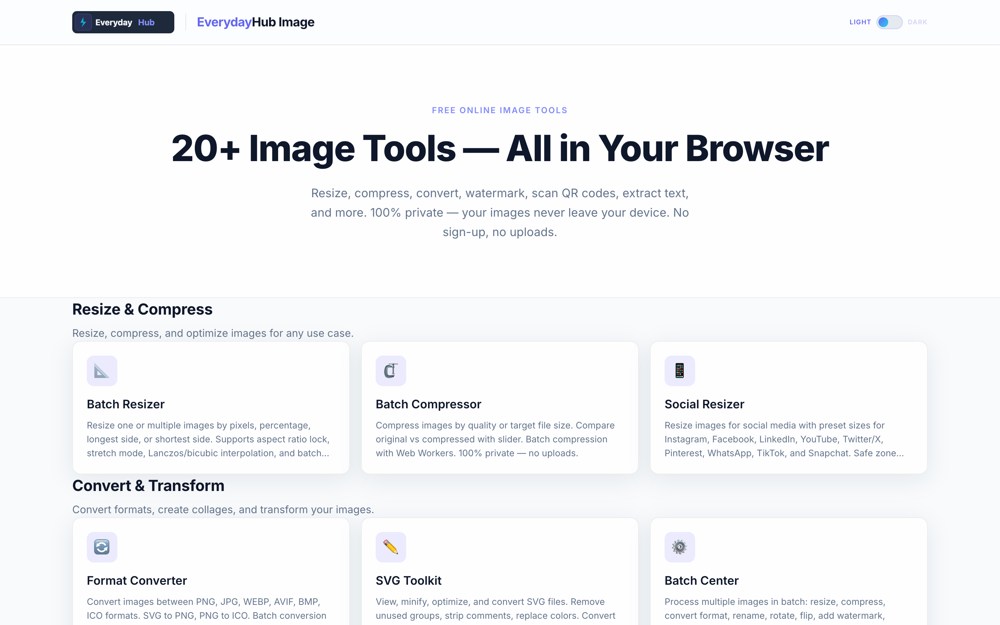
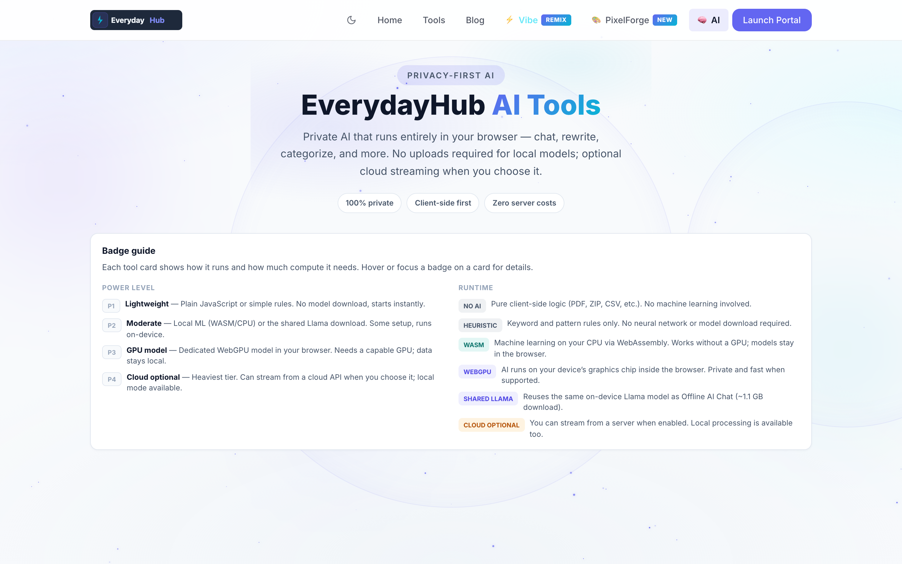
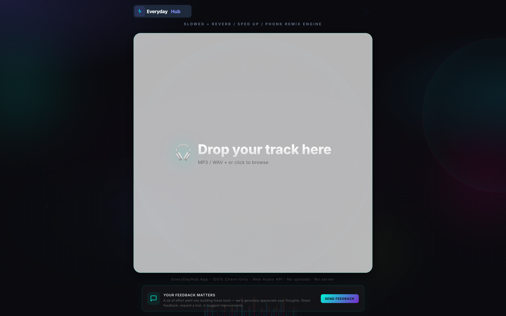
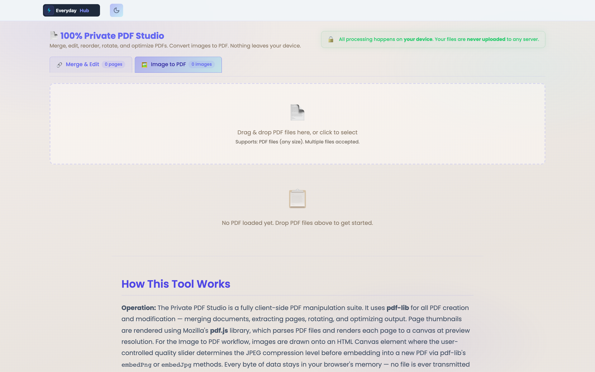

<div align="center">

# EverydayHub

**Privacy-first digital utilities — built for your browser, not our servers.**

[](https://everydayhub.app/)
[](LICENSE)
[](#privacy--our-commitment)

</div>

---

## Intention

EverydayHub exists to prove that powerful software does not require surveillance. We build **100+ free, ad-free tools** — for data, images, PDFs, finance, audio, and AI — that run **entirely in the user's browser**. No accounts. No uploads. No hidden analytics.

Our mission is simple: **give everyone professional-grade utilities that respect their data as much as their time.**

### Discipline

We treat engineering craft as a product feature, not a footnote.

| Principle | What it means in practice |
| --- | --- |
| **Privacy by architecture** | Sensitive work stays on-device. We design for zero server-side data paths first, then add optional cloud modes only where users explicitly choose them. |
| **Minimal, focused diffs** | Each module does one job well. No speculative abstractions, no feature bloat for its own sake. |
| **Performance as UX** | Web Workers offload heavy parsing and generation. TanStack Virtual keeps grids fast at scale. Lazy routes and code-splitting keep first paint lean. |
| **Accessible, intentional UI** | Shared EverydayHub design tokens, icon-only theme toggles, keyboard-friendly navigation, and semantic HTML across React apps and static tools. |
| **Open transparency** | Source-aligned documentation, clear runtime badges (JavaScript · WASM · WebGPU · Cloud optional), and honest capability labels in the AI Hub. |

> *"The best interface is the one that disappears — leaving only the work you came to do."*

---

## The Composer

### Architecture & Tech Stack

EverydayHub is a **multi-surface product family** unified by shared branding, theme persistence (`everydayhub-theme` in `localStorage`), and a privacy-first engineering contract. Production ships through **Cloudflare Workers / Pages** (`wrangler`), with React SPAs built via **Vite** and static tool pages served from the main hub.

| Layer | Technology | Role |
| --- | --- | --- |
| **UI Framework** | React 19 | Component model for DataForge, Image Suite, AI Hub, and Vibe Studio |
| **Build Tooling** | Vite 7–8 | Dev server, HMR, production bundling, `@/` path aliases |
| **Language** | TypeScript 5.8–6 | Type-safe stores, workers, and tool configs |
| **Styling** | Tailwind CSS 3.4 / 4.x | Utility-first layout; shared hub design tokens in `index.css` |
| **Routing** | React Router DOM 7 | SPA navigation (`/DataForge`, `/image`, AI widgets) |
| **State** | Zustand 5 | Per-studio stores (CSV, JSON, XML, Excel, Generator) |
| **Data Grids** | TanStack Table + Virtual | High-performance CSV/Excel browsing |
| **Parsing & I/O** | PapaParse · fast-xml-parser · SheetJS (`xlsx`) · file-saver | Client-side CSV, XML, Excel ingest and export |
| **Mock Data** | @faker-js/faker | 180+ categorized synthetic data types |
| **PDF Export** | jsPDF + jsPDF-AutoTable | Invoice bundles, contact sheets, generator exports |
| **Concurrency** | Web Workers (ES modules) | CSV/JSON/XML/Excel parsing; mock-data generation up to 100k rows |
| **Local AI / ML** | @imgly/background-removal · ONNX Runtime Web · @huggingface/transformers · @wllama/wllama · Tesseract.js | On-device segmentation, chat, OCR — no cloud required |
| **Audio** | Web Audio API | Vibe Studio effects pipeline (reverb, pitch, 8D, phonk) |
| **Deployment** | Cloudflare Workers · Wrangler · D1 (AI chat tokens) | Global edge hosting; optional worker-backed AI streaming |
| **Static Tools** | Vanilla HTML / CSS / JavaScript | 75+ portal utilities in `NewWebsite/` |
| **Linting** | ESLint · Oxlint | Code quality across TypeScript and React surfaces |

### Repository Layout

Understanding where things live helps contributors navigate the ecosystem quickly.

```
EveryDayHub.App/       ← You are here — public portal, docs, GitHub Pages landing
CSVStudio/             ← DataForge source (CSV · JSON · XML · Excel · Mock Data)
Image/                 ← Image Suite source (20 browser-local image tools)
ai/                    ← EDH AI Hub (8 privacy-first AI widgets + Cloudflare worker)
vibe/                  ← Vibe Studio (Web Audio remix engine)
NewWebsite/            ← Tools Portal static pages (75+ individual utilities)
everydayhub-main/      ← Production hub bundle deployed to everydayhub.app
browserTools/          ← Tools Portal PWA build
scripts/               ← Shared theme migration & bulk HTML utilities
```

**Data flow (typical tool session):**

```
User file ──► FileReader / Drag-drop ──► In-memory parse (Worker thread)
                                              │
                                              ▼
                                    Zustand store / Canvas / WASM model
                                              │
                                              ▼
                              Download / Export (never leaves the device)
```

---

## Privacy & Our Commitment

EverydayHub is **Privacy First** by design — not by marketing copy.

### Local execution, always

| Asset class | How it is processed | Third-party cloud? |
| --- | --- | --- |
| **CSV, JSON, XML, Excel files** | Parsed in Web Workers via PapaParse, native JSON, fast-xml-parser, and SheetJS | **Never** |
| **Mock / synthetic data** | Generated locally with Faker.js inside a dedicated worker (up to 100,000 rows) | **Never** |
| **Image edits & batch ops** | Canvas API, Web Workers, Tesseract.js OCR — all in-browser | **Never** |
| **AI Background Remover (Tools Portal)** | `@imgly/background-removal` WASM model downloaded once; inference runs on **your CPU/GPU** | **Never** — model assets only, not your photos |
| **AI Background Remover Widget** | Embeddable standalone widget using the same shared local removal utility | **Never** |
| **Passport Photo Maker** | Cropper.js + local canvas compositing; optional on-device AI background removal | **Never** |
| **AI Hub — Offline Chat** | Optional ~1.1 GB Llama download for 100% on-device chat; cloud streaming is **opt-in** | **Only if you enable cloud mode** |
| **AI Hub — WebGPU tools** | Segmentation, sentiment, rewriting run on-device when models are loaded | **Never** (local path) |

> *"Privacy is not an option, and it shouldn't be the price we accept for just getting on the Internet."*  
> — **Tim Berners-Lee**

### Customer data protection commitments

We commit to the following — today and as the product evolves:

- **No file uploads** for core DataForge, Image, and Tools Portal workflows. Your documents, spreadsheets, and photos are read from disk into browser memory only.
- **No accounts required** to use any EverydayHub utility. We do not maintain user profiles or behavioral databases for tool access.
- **No third-party analytics or ad trackers** on privacy-critical tool surfaces. We do not sell, rent, or broker user data — because we do not collect it.
- **No cookies for tracking.** Theme preference (`everydayhub-theme`) is stored in `localStorage` on your device for UX continuity only.
- **Transparent AI runtime labels.** AI Hub tools display power level (P1–P4) and runtime badges (Heuristic · WASM · WebGPU · Cloud optional) so you know exactly where computation happens.
- **Honest optional cloud.** When cloud AI streaming is available, it is explicitly chosen by the user — never silently enabled.
- **Open documentation.** This repository and our live `llms.txt` describe capabilities, limits, and privacy posture for humans and machines alike.

> *"Innovation distinguishes between a leader and a follower — but trust is what keeps users coming back."*

---

## Feature Breakdown

Below are the primary functional modules across the EverydayHub ecosystem. Each solves a real workflow without sending your data elsewhere.

---

### DataForge — Privacy-First Data Workspace

**Route:** [everydayhub.app/DataForge](https://everydayhub.app/DataForge/) · **Source:** `CSVStudio/`

A unified React studio for structured data — CSV, JSON, XML, Excel, and synthetic datasets — with a shared shell, sidebar navigation, and per-format tool panels.

| Studio | Capabilities |
| --- | --- |
| **CSV** | Virtualized data grid, cleaner (trim, dedupe, find/replace), splitter, combiner, column manager, column statistics |
| **JSON** | Tree + code view, pretty-print/minify, validator, JSON ↔ CSV conversion, JSONPath query, top-level key filter |
| **XML** | Tree + code view, format/minify, well-formed validation, XML → JSON/CSV export |
| **Excel** | XLSX/XLS multi-sheet viewer, whitespace trim, empty-row removal, export as CSV/XLSX/JSON |
| **Mock Data** | Drag-and-drop schema builder, 180+ Faker types, live preview grid, 13 export formats, up to 100k rows via worker |





---

### Tools Portal — 75+ Standalone Utilities

**Route:** [tools.everydayhub.app](https://tools.everydayhub.app/) · **Source:** `NewWebsite/` + `browserTools/`

Category-organized static tools for PDF, image, text, finance, developer, productivity, and academic workflows — each page is a self-contained HTML/CSS/JS module.



---

### Passport Photo Maker

**Route:** [tools.everydayhub.app/passport-photo-maker](https://tools.everydayhub.app/passport-photo-maker/)

Creates **print-ready passport and ID photos** with crop guides, preset aspect ratios, background color control, and multi-format export (PNG, JPG, WebP, TIFF). Optional **on-device AI background removal** composites a clean backdrop without uploading your portrait to any server.

**Solves:** Expensive photo booths, privacy concerns with online passport services, and inconsistent print sizing.



---

### Standalone Background Remover Widget

**Routes:**  
- [tools.everydayhub.app/background-remover](https://tools.everydayhub.app/background-remover/)  
- [tools.everydayhub.app/ai-background-remover](https://tools.everydayhub.app/ai-background-remover/)  
- Embeddable widget: `ai-background-remover-widget.html`

Powered by **`@imgly/background-removal`** loaded as an ES module — the WASM segmentation model runs locally with single-thread mode (no SharedArrayBuffer / cross-origin isolation required). Drag-and-drop in, transparent PNG out.

**Solves:** Quick product shots, profile photos, and design assets without SaaS subscriptions or cloud upload pipelines.





---

### Image Suite (PixelForge Family)

**Route:** [everydayhub.app/image](https://everydayhub.app/image/) · **Source:** `Image/`

Twenty lazy-loaded React tools across six categories — resize, convert, edit, analyze, create, and scan — with batch ZIP downloads and Web Worker parallelism.

| Category | Tools |
| --- | --- |
| **Resize & Compress** | Batch Resizer, Batch Compressor, Social Resizer |
| **Convert & Transform** | Format Converter, Collage Maker, Batch Center, SVG Toolkit |
| **Edit & Enhance** | Image Watermark, Effects Studio (20+ filters), Rounded Corners |
| **Analyze & Extract** | Color Analyzer, EXIF Viewer, EXIF Remover, Before/After Comparison |
| **Create & Generate** | Meme Generator, Contact Sheet, Screenshot Beautifier, Device Mockup |
| **Scan & Read** | QR/Barcode Scanner, OCR (Tesseract.js) |



---

### EDH AI Hub

**Route:** [ai.everydayhub.app](https://ai.everydayhub.app/) · **Source:** `ai/`

Eight privacy-first AI widgets with explicit runtime and power-level badges:

| Tool | Runtime | Description |
| --- | --- | --- |
| **Offline AI Chat** | WebGPU / Cloud optional | Local Llama (~1.1 GB) or opt-in cloud streaming |
| **Bulk Invoice PDF Generator** | No AI | CSV → hundreds of invoice PDFs in a ZIP |
| **Smart Document Auto-Categorizer** | Shared Llama | Classify pasted text into custom labels |
| **AI Background Remover & Blur** | WebGPU | In-browser segmentation and blur |
| **Local Document Search** | Heuristic + optional Llama | Keyword-ranked chunk search with AI answers |
| **PII & Face Redactor** | Heuristic | Pattern-based sensitive text redaction |
| **Sentiment & Tone Analyzer** | Shared Llama | Emotional tone scoring with keyword fallback |
| **AI Text Rewriter & Tone Changer** | Shared Llama | Summarize, elaborate, rewrite, email conversion |



---

### Vibe Studio

**Route:** [vibe.everydayhub.app](https://vibe.everydayhub.app/) · **Source:** `vibe/`

Browser-based audio remix engine using the **Web Audio API** — Slowed + Reverb, Sped Up (Nightcore), Daycore, 8D Audio, Phonk Bass Boost, and Lo-Fi edits. Unlimited file size, zero uploads, WAV export.



---

### PDF, Finance & Developer Tools (Portal Highlights)

| Category | Examples |
| --- | --- |
| **PDF** | Annotate PDF, PDF Studio, Merge PDF, Image to PDF |
| **Finance** | EMI Calculator, SIP Compare, Salary Calculator, Bill Splitter, Stock Average |
| **Developer** | QR Generator, UUID Generator, Timestamp Converter, File Hash Generator, UTM Builder |
| **Text** | Regex Tester, Markdown Editor, Text Diff, JSON Formatter, ASCII Banner Generator |



---

## Navigation Hub

| Resource | Link |
| --- | --- |
| **Main Application** | [https://everydayhub.app](https://everydayhub.app/) |
| **Tools Portal** | [https://tools.everydayhub.app](https://tools.everydayhub.app/) |
| **DataForge** | [https://everydayhub.app/DataForge](https://everydayhub.app/DataForge/) |
| **Image Suite** | [https://everydayhub.app/image](https://everydayhub.app/image/) |
| **AI Hub** | [https://ai.everydayhub.app](https://ai.everydayhub.app/) |
| **Vibe Studio** | [https://vibe.everydayhub.app](https://vibe.everydayhub.app/) |
| **Blog** | [https://everydayhub.app/blog](https://everydayhub.app/blog/) |
| **This Repository** | [https://github.com/krishnasfdcc-a11y/EveryDayHub.App](https://github.com/krishnasfdcc-a11y/EveryDayHub.App) |
| **Issue Tracker** | [https://github.com/krishnasfdcc-a11y/EveryDayHub.App/issues](https://github.com/krishnasfdcc-a11y/EveryDayHub.App/issues) |
| **Feedback / Support** | [feedback@everydayhub.app](mailto:feedback@everydayhub.app) |

---

## Getting Started (Contributors)

Individual apps ship their own dev scripts. Example — **DataForge**:

```bash
cd CSVStudio
npm install
npm run dev
```

Open [http://localhost:5173/DataForge/](http://localhost:5173/DataForge/).

Production publish into the main hub:

```bash
cd CSVStudio
npm run publish:hub   # builds and copies dist → everydayhub-main/DataForge/
```

---

## License

EverydayHub is open source under the **MIT License** unless otherwise noted in a submodule's `LICENSE` file.

---

<div align="center">

**Built with discipline. Shipped with privacy. Shared with the world.**

[EverydayHub](https://everydayhub.app/) · [GitHub](https://github.com/krishnasfdcc-a11y/EveryDayHub.App) · [Report an Issue](https://github.com/krishnasfdcc-a11y/EveryDayHub.App/issues)

</div>
